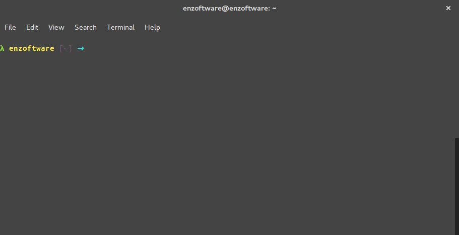

# somnum.sh
:sleeping: Another shell script to turn off your computer via terminal 
---

---
To make easier the things move the `somnum.sh` file to your root directory and then type in terminal 
```shell
export somnum=~/somnum.sh
```
